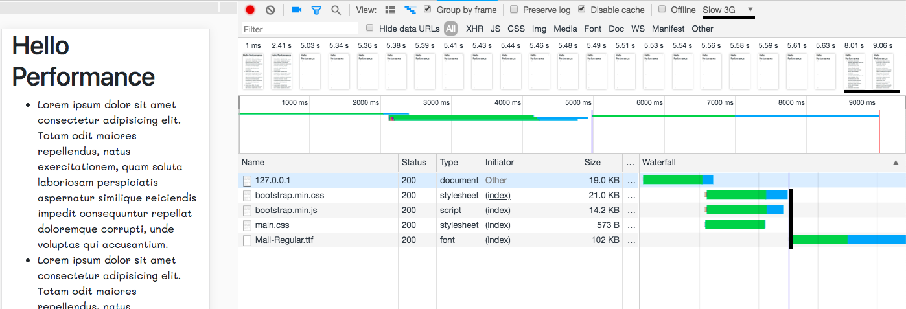
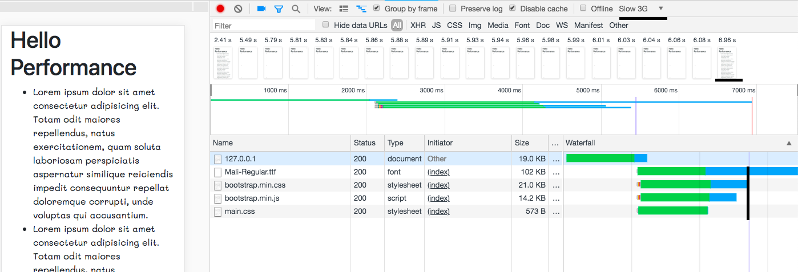
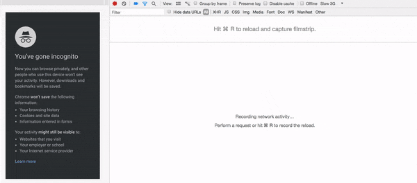
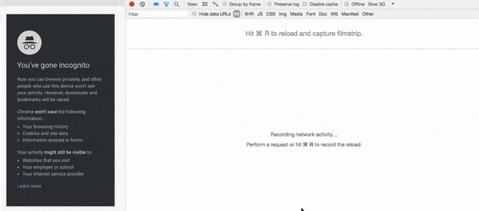
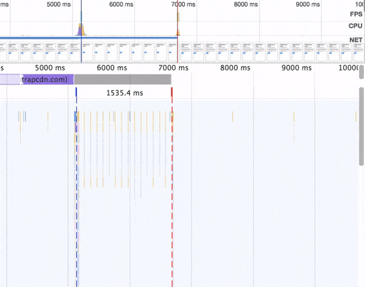
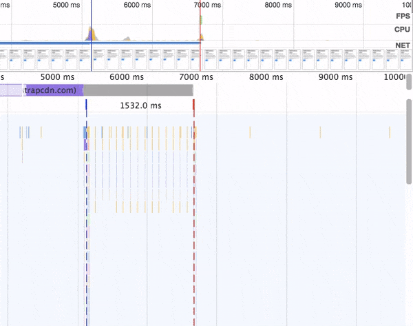
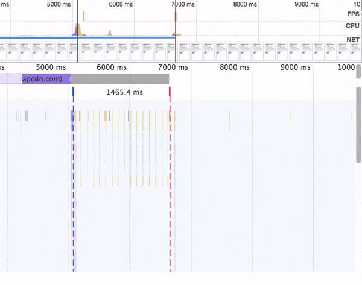
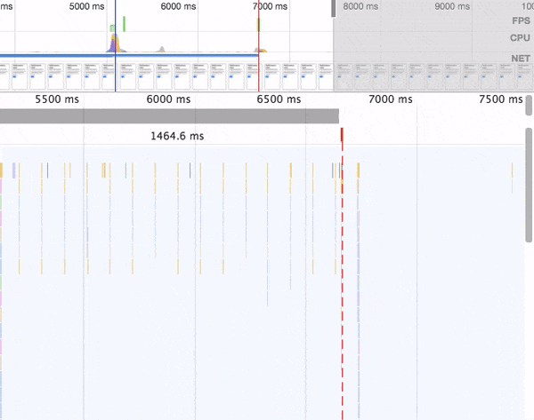

It shouldn't be a secret that modern web apps are supposed to load in a thousand of a second, and work as smooth as native app. Tools for finding application bottlenecks are created for developers. For instance, in Google Chrome there are really awesome tools for auditing application performance, and other vendors also try not to fall behind (probably). React team has made some improvements in its devtool extension, and has added a new profiler. If you haven't tried it yet, then you definitely should at least read a [blog post](https://reactjs.org/blog/2018/09/10/introducing-the-react-profiler.html).

Addie Osmani is the master of performance optimizations. He has lots of must-read resources about how not to ruin your performance. I insist on adding his [blog](https://medium.com/@addyosmani) to bookmarks in order to becoming a real 🧙‍ of speed.

In the article I'll try to give some practical advice with an easy explanation of some tips.

## 👨‍💻 Preloading

Let me start with data preloading. Imagine that we have a following issue and then try to find a good solution. So we have the following page.

```html
<link rel="stylesheet" href="https://stackpath.bootstrapcdn.com/bootstrap/4.1.3/css/bootstrap.min.css" />
<script src="https://stackpath.bootstrapcdn.com/bootstrap/4.1.3/js/bootstrap.min.js"></script>
<link rel="stylesheet" href="/styles/main.css" />
```

And in file `main.css` we try to load custom font.

```css
@font-face {
    font-family: 'Mali';
    font-style: normal;
    font-weight: 400;
    src: url(/fonts/mali/Mali-Regular.ttf) format('truetype');
}
```

> Important: In the example we load file in ttf extension for purpose. The first step to optimize performance should be using standard font, and if the UX engineer insist on using custom font - then you must use modern file formats, like woff/woff2 [link](https://transfonter.org/formats). I've used Truetype font in order to increase the loading time.

Open network tab in browser console and reload the page.



So what we may notice here. At first the browser downloads styles and scripts, and only after this - font files. Please notice that browser starts downloading font files only after the font _actually_ applies to element. For a short period of time the text hasn't displayed at all.

The text with default font appears only after 8 second after initial request, and with custom font only after 9 second. (I am going to speak in detail about fonts application later in this post).

So could we somehow tell browser to load the font file in advance? Without waiting for actual application.

Preloading is going to help in that situation. We should implement several easy steps.

Step 1. Add link to resource with preload attribute in html document.

```html
<!-- Предзагрузка -->
<link rel="preload" as="font" crossorigin="crossorigin" type="font/ttf" href="/fonts/mali/Mali-Regular.ttf" />
<!-- /Предзагрузка -->
<link
    rel="stylesheet"
    href="https://stackpath.bootstrapcdn.com/bootstrap/4.1.3/css/bootstrap.min.css"
    integrity="sha384-MCw98/SFnGE8fJT3GXwEOngsV7Zt27NXFoaoApmYm81iuXoPkFOJwJ8ERdknLPMO"
    crossorigin="anonymous"
/>
<script
    src="https://stackpath.bootstrapcdn.com/bootstrap/4.1.3/js/bootstrap.min.js"
    integrity="sha384-ChfqqxuZUCnJSK3+MXmPNIyE6ZbWh2IMqE241rYiqJxyMiZ6OW/JmZQ5stwEULTy"
    crossorigin="anonymous"
></script>
<link rel="stylesheet" href="/styles/main.css" />
```

Step two. Grab some 🍻 and enjoy.



При прочих равных условия мы можем наблюдать, что теперь шрифты загружаются сразу вместе с другими ресурсами. И уже на 7 секунде мы получаем уже готовую отрисованную страницу. Наш выигрыш составил 1 секунду. Секунду, Кард, мы сумели выиграть таким простым хаком. Но если все так просто, то давайте предзагружать все ресурсы сразу.

Но все не может быть так хорошо, и с большой силой приходит и ответственность. На HTTP/1 браузер умеет устанавливать 6 стабильных подключений к одному хосту. Таким образом, установив повышенный приоритет на скачивание одним файлам, мы откладываем скачивание других файлов.

Так что же следует отправлять на предзагрузку. Как говорится во многих источниках "То что необходимо для текущей навигации". WTf? Для себя я сформулировал такое правило. Если у вас внтури стилей или внутри скриптов есть ссылки на ресурсы, которые необходимы для отрисовки страницы - то стоит подумать о том чтобы отправлять их на предзагрузка. Почему все еще стоит подумать? Дальше стоит рассматривать каждый конкретный случай и думать чтоже необходимо показать пользователю раньше.

Еще один важный момент. Вернемся к SPA приложениям. Допустим у нас есть клиентский роутинг, и код для каждой страницы подгружается отдельным чанком. А нельзя ли подгружать эти чанки кода, чтобы когда пользователь решил перейти на страницу, ему не пришлось бы ждать пока загрузится файл скриптов? Ответ - **нет.** См. выше. Предзагрузка нужна чтобы помочь пользователям быстрее получить отрисованную текущую страницу, для будущих действий предзагрузка не поможет. В Google Chrome будет даже выброшен warning в консоль о том что предзагруженный ресурс не был использован в течении 3 секунд.

Но где же нам искать спасения?

## Prefetching

Попробуем представить следующую ситуацию, на странице есть попап внутри которого есть изображение. Предположим что попап и его контент не несут большой нагрузки, и пользователь откроет его только через какой-то промежуток времени или по наступлению какого-либо события. Таким образом можно сделать вывод, что картинку внтури можно и не грузить для начальной загрузки страницы. А загружать только при непосредственном открытии попапа.

Подобный функционал можно реализовать достаточно просто.

```html
<button class="btn btn-primary" id="btn">Click</button>
<dialog id="dlg">
    <section>
        <header>Hi, I am a modal dialog</header>
        
    </section>
</dialog>
```

И непосредственный обработчик

```js
document.getElementById('btn').addEventListener('click', () => {
    dlg.showModal()
    const images = document.querySelectorAll('img[data-src]')
    for (let image of images) {
        image.src = image.dataset.src
        image.removeAttribute('data-src')
    }
})
```

В результате мы получаем:



Обратите внимание, что загрузка изображения начинается только при нажатии на кнопку. Но что если изображение слишком большое, а интернет соединение не самое стабильное. В таком случае изображение будет отрисовываться постепенно, а это 💩 а не good user experience. На помощь нам придёт prefetch.

Prefetch - это своего вида декларативный запрос, основная цель которого с самым низким приоритетом, в момент когда в браузере не происходит никакой работы, когда все ресурсы загружены, а скрипты выполены, скачать ресурс и положить его в кэш. Чтобы в дальнейшем достать его из кэша и не дать пользователю созерцать великолепную загрузку изображения.

Все что нам стоит сделать это добавить одну новую строчку

```html
<dialog id="dlg">
    <section>
        <header>Hi, I am a modal dialog</header>
        <!-- Prefetch -->
        <link rel="prefetch" as="image" href="/photo.jpg" />
        <!-- /Prefetch -->
        
    </section>
</dialog>
```



Обратите внимание, что картинка начинает загружаться до того как пользователь нажал на кнопку, а уже при открытии диалового окна - файл загружается из кэша.

Как и к preload, к prefetch тоже надо относиться с осторожностью. К примеру если этот попап открывается менее чем в 5% случаев захода на страницу, то зачем заставлять пользователя переплачивать за закачку ресурсов, которые им и не пригодятся?

## Текущий итог

Итак, если подвести небольшой промежуточный итог, то мы научились:

-   Повышать приоритет загрузки ресурсов, которые **обязательно** будут загружены в рамках текущей навигации. Запрос на загрузку ресурсов может исходить как из javascript так и из css.
-   Не грузить ресурсы в момент начальной загрузки страницы, а предзагружать в момент когда браузер находится в состоянии простоя, т.о. улучшая user experience.

Неплохое начало. Что же мы еще подтьюнить? В секции когда мы освещали preload, я упоминал про то как браузер применяет шрифты. Чтобы вам не возвращаться вверх, мы улучшили скорость отрисовки контента до 7 секунд. Причем на 6-ой секунде стили и скрипты выполнились, а оставшееся время мы ждем пока докачаются и применятся кастомные шрифты. Оказывается что и с этим мы можем поиграться и попытаться добиться улучшения пользовательского опыта пользования сайтом.

## Способы применения шрифтов

По-умолчания браузер не показывает текст, пока кастомный шрифт не подгрузится, оставляя пользователя в ожидании получения осмысленной текстовой информации.

 _Этот "эффект" получил название Flash of Invisible Text (вспышка невидимого текста) или сокращенно FOIT._

На нашем тестовом сайте вымышленному пользователю пришлось бы подождать 1.5 секунды прежде чем прочитать увлекательный латинский псевдотекст. Этот режим получил название block.

> Если быть совсем педантично точным, то по-умолчанию бразуер выставливают свойство в auto. Но практически во всех современных браузерах block === auto.

Если мы все же хотим дать возможность пользователю начать читать текст не дожидаясь загрузки шрифта, то мы можем выставить в значение swap. Говоря другими словами, пусть вначале отрисуется следующий в списке семейства шрифтов, который уже установлен в системе, и который не надо дополнительно скачивать, а когда загрузится кастомный шрифт, то мы просто перерисуем текст с новым шрифтом.

 _Этот "эффект" получил название Flash of Unstyled Text (вспышка невидимого текста) или сокращенно FOUT._

И собственно что нам надо указать в файле стилей

```css
@font-face {
    font-family: 'Mali';
    font-style: normal;
    font-weight: 400;
    src: url(/fonts/mali/Mali-Regular.ttf) format('truetype');
    font-display: swap;
}
```

Вот она - истина. Но давайте поразмышляем над следующим вопросом. Мы предзагружаем шрифт, и он становится доступен для использования спустя скажем 50 мс после отрисовки на дефолтном шрифте, т.о. у нас получится слишком быстрое мерцание текста. Что же делать? На помощь приходит следующие свойство - fallback.

Сразу пример кода

```css
@font-face {
    font-family: 'Mali';
    font-style: normal;
    font-weight: 400;
    src: url(/fonts/mali/Mali-Regular.ttf) format('truetype');
    font-display: fallback;
}
```

This is how it now looks in network panel



Как вы можете наблюдать браузер вначале ничего не рисует на протяжение короткого периода времени, как в примере со свойством block, затем алгоритм следующий - если шрифт скачался и доступен то используем его, если нет - то используем дефолтный шрифт и ждем в течении 3 секунд пока подгрузится кастомный и затем как в примере со swap заменяем шрифты. Если на протяжении 3 секунд шрифт так и не подгрузился, то прекращаем ждать и используем fallback шрифт.

And finally the latest option is optional



This is the easiest case, I think. We tell browser to give us super narrow time window, and if we have enough time to load the font then display it immediately, and if no - then use fallback font.

У каждого из этих вариантов есть свои плюсы и минусы. Надо смотреть и от конкретной цели выбирать средство. К примеру, если шрифт меняется очень быстро - то создается эффект мерцания, если показывать fallback шрифт и дать пользователю возможность зацепиться за текст и потом подменять шрифт - то создается когнитивная нагрузка. Вообщем здесь есть только одна рекомендация - стараться подобрать fallback шрифт максимально похожим на кастомный, а все остальное уже зависит от конкретных целей.

## Bonus 🙀

Lets image a real task. We have a React or Vue project. And in that project we'd like to create several pages, and we'd also like to split the whole code into chunks based on pages, and load them when needed. We also learn that from page A to page B user is going to go in 99% of chances. It is high time to prefetch the chunk, but... The whole project is bundling with webpack, so where should we place `<link type="prefetch">`? Answer: webpack has such api out-of-the-box 🤗

```js
import(
    /* webpackPrefetch: true */
    '/src/pages/Profile'
).then(({default}) => apply(default))
```

[Documentation](https://webpack.js.org/guides/code-splitting/#prefetching-preloading-modules)

In webpack terminology this is called magic comments and we are able to use both preload and prefetch strategies that way.

## One more bonus

I've touched only the smallest part about loading performance. This is the whole science. And if your case is only to create a fast web site without all that rocket science than give a try to [Gatsby](https://www.gatsbyjs.org/). It has lots of functionality out-of-the-box and it really some perf magic. Piece & love, react & gatsby to every one of you! ✌️
